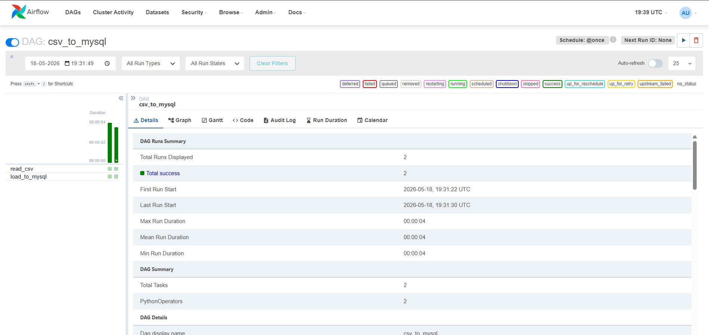
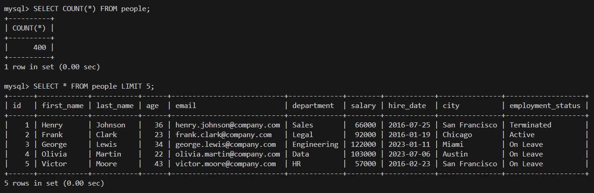

# CSV to MySQL Airflow Pipeline

An end-to-end data pipeline built with Apache Airflow, MySQL, and Docker.

## What it does
Loads a 200-row employee dataset (CSV) into a MySQL database using an Airflow DAG with two tasks:
- `read_csv` — reads `people.csv` into memory
- `load_to_mysql` — creates the table and inserts all records

## Stack
- Apache Airflow 2.9.1
- MySQL 8.0
- PostgreSQL 17 (Airflow metadata DB)
- Docker Compose
- Python (pandas, pymysql, sqlalchemy)

## Setup
1. Clone the repo
2. Copy `.env.example` to `.env` and fill in values
3. Run `docker compose up airflow-init` to initialize
4. Run `docker compose up -d` to start all services
5. Open `http://localhost:8080` and log in with the credentials you set in `.env`
6. Trigger the `csv_to_mysql` DAG

## Screenshots

## Limitations & Future Improvements

- **Idempotency** — re-triggering the DAG inserts duplicate rows since there is no 
  uniqueness constraint on `id`. A production pipeline would use `INSERT IGNORE` or 
  `ON DUPLICATE KEY UPDATE` to make runs safely repeatable.

- **Runtime dependency installation** — packages are installed via 
  `_PIP_ADDITIONAL_REQUIREMENTS` on every container start. The production approach 
  is a custom Docker image with dependencies baked in at build time.

- **XCom at scale** — passing the full dataset through Airflow's metadata DB is 
  acceptable for small files but does not scale. A production pipeline would write 
  to object storage (S3, GCS) or a staging table and pass only a reference through 
  XCom.